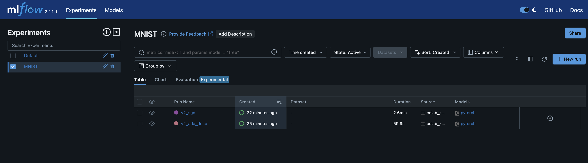
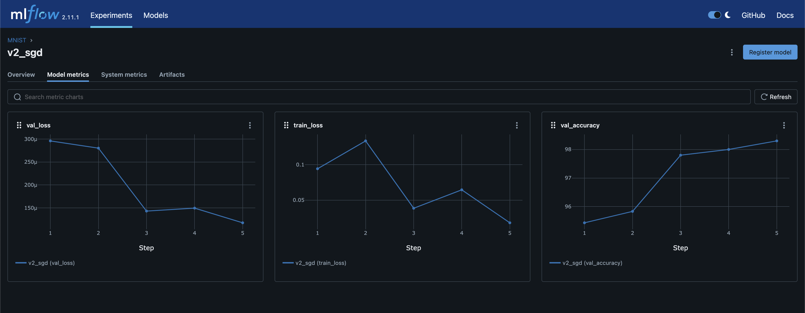
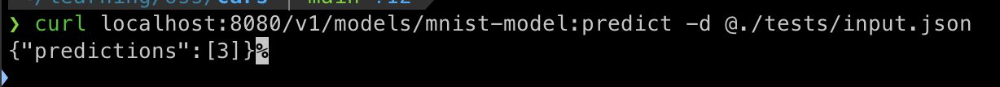
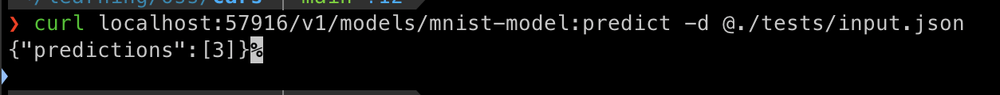
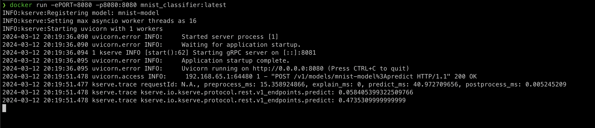
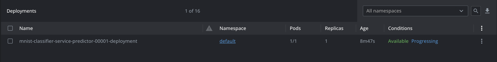
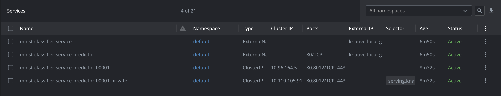

## Tech Stack used:
* **PyTorch**: model training and fine-tuning
* **MlFlow**: experiment tracking and logging
* **Hydra**: configuration management
* **KServe**: model serving
* **minikube**: run a K8s cluster locally

## Approach:
1. I chose to fine-tune a pre-trained **MobileNetV2** model, because low inference latency was a priority. This is one of the model that was built to run on the edge, so its very small in size and has fast inference, with reasonable accuracy.
2. Logged all the **parameters**, **metrics** and **artifacts** to MLFlow during the fine-tuning process, which helped in choosing the final model to deploy.
3. Since I had to do some pre-processing on the input data for it to be compatible with the model input, I used the `Custom Predictor` feature of **KServe** and wrote a custom predictor for the PyTorch model.
4. Packaged everything into a **Docker image** and tested locally.
> **Note:** For this task I also copied the model into the Docker image (for simplicity), but we can keep it outside in an object storage as well, for easy switching between models.
5. Started a **minikube** cluster and installed **KServe** on it.
6. Created a **KServe Inference Service** and applied it to the minikube cluster.
7. Used Port-Forwarding from the Inference K8s service to test on localhost.

## Further Enhancements:
* Use **Poetry** python package manager for better dependency management
* Use **Prometheus** for service monitoring

## Screenshots:

### MLFlow

MlFlow Experiments

MlFlow Run Metrics

### Curl

Local curl prediction request

K8s curl prediction request (using port-forwarding)

Docker image running locally

### K8s Resources

K8s Deployment resource by KServe inference service CR

K8s Service resource by KServe inference service CR

